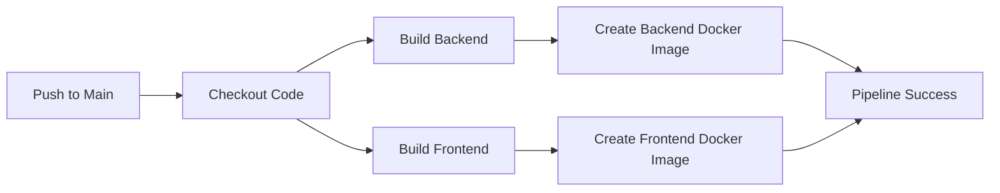

# Kaiburr Task 4 - CI/CD Pipeline

## 📋 Overview

This task implements a **CI/CD pipeline** for the Kaiburr Task Manager application using **GitHub Actions**. The pipeline automatically builds both the Java Spring Boot backend and the React TypeScript frontend whenever code is pushed to the repository, ensuring continuous integration and delivery.

## ✨ Features

- ✅ **Automated Builds** - Triggers on every push or pull request
- ✅ **Backend Build** - Compiles Java Spring Boot application with Maven
- ✅ **Frontend Build** - Builds React TypeScript application with npm
- ✅ **Docker Images** - Creates containerized versions of both applications
- ✅ **Build Status** - Real-time feedback via GitHub Actions interface
- ✅ **Multi-Stage Pipeline** - Separate jobs for backend and frontend

## 🛠️ Technologies

- **GitHub Actions** - CI/CD automation
- **Maven** - Java build tool
- **npm** - Node.js package manager
- **Docker** - Containerization
- **Java 17** - Backend runtime
- **Node.js 20** - Frontend runtime

## 📁 Project Structure

```
Kaiburr-Task-Karthik-S-CI-CD/
│
├── .github/
│   └── workflows/
│       └── ci.yml                    # GitHub Actions workflow
│
├── taskrunner/                       # Backend (Spring Boot)
│   ├── src/
│   ├── pom.xml
│   ├── Dockerfile
│   ├── mongo-deployment.yaml
│   └── taskrunner-deployment.yaml
│
├── task-manager-ui/                  # Frontend (React)
│   ├── src/
│   ├── public/
│   ├── package.json
│   └── Dockerfile
│
└── README.md
```

## 🔄 CI/CD Pipeline Details

### Workflow File: `.github/workflows/ci.yml`

The pipeline performs the following steps:

### 1. **Trigger**
```yaml
on:
  push:
    branches: [ main ]
  pull_request:
    branches: [ main ]
```
Runs on every push or pull request to the `main` branch.

### 2. **Build Backend**

- ✅ Sets up **Java 17**
- ✅ Caches Maven dependencies for faster builds
- ✅ Runs `mvn clean package -DskipTests`
- ✅ Builds backend Docker image

### 3. **Build Frontend**

- ✅ Sets up **Node.js 20**
- ✅ Installs dependencies with `npm ci`
- ✅ Builds production React bundle with `npm run build`
- ✅ Builds frontend Docker image

## 🚀 How to Use

### Automatic Trigger

The pipeline runs automatically when you:
1. Push code to the `main` branch
2. Create a pull request targeting `main`

### Manual Testing

1. **Make a change and push:**
```bash
git add .
git commit -m "Trigger CI/CD pipeline"
git push origin main
```

2. **View the workflow:**
   - Go to your GitHub repository
   - Click on the **Actions** tab
   - Select the latest workflow run
   - View real-time logs and build status

## 📊 Pipeline Stages



## 🔍 Monitoring Builds

### Check Build Status

1. Navigate to the **Actions** tab in your GitHub repository
2. View the list of workflow runs
3. Click on any run to see detailed logs
4. Check individual job statuses (Backend Build, Frontend Build)

### Build Badge

Add this badge to your main README to show build status:

```markdown

```

## 🐛 Troubleshooting

### Build Failures

**Backend Build Fails:**
- Check Java version compatibility
- Verify `pom.xml` dependencies
- Review Maven build logs in Actions tab

**Frontend Build Fails:**
- Check Node.js version
- Verify `package.json` dependencies
- Review npm install/build logs

**Docker Build Fails:**
- Check Dockerfile syntax
- Verify base images are accessible
- Review Docker build logs

### Common Issues

| Issue | Solution |
|-------|----------|
| Maven dependencies fail | Check internet connection and Maven Central availability |
| npm install fails | Clear cache with `npm cache clean --force` |
| Docker build timeout | Optimize Dockerfile layers |
| Permission denied | Check GitHub Actions permissions in repo settings |

## 🔧 Customization

### Modify the Pipeline

Edit `.github/workflows/ci.yml` to:
- Add testing stages
- Deploy to cloud platforms
- Push Docker images to registries
- Add code quality checks
- Configure notifications

### Example: Add Testing Stage

```yaml
- name: Run Backend Tests
  run: cd taskrunner && mvn test

- name: Run Frontend Tests
  run: cd task-manager-ui && npm test
```

## 📈 Future Enhancements

- [ ] Add automated testing
- [ ] Deploy to cloud platforms (AWS, Azure, GCP)
- [ ] Push Docker images to Docker Hub
- [ ] Add code coverage reports
- [ ] Implement staging and production environments
- [ ] Add security scanning
- [ ] Configure Slack/Email notifications

## 👨‍💻 Author

**Name:** Karthik S  
**Project:** Kaiburr Assessment - Task 4  
**Date:** October 2025

## 📄 License

This project is part of the Kaiburr Assessment.

## 🤝 Contributing

This is an assessment project and is not open for contributions.

---

For questions or issues, please contact the author.